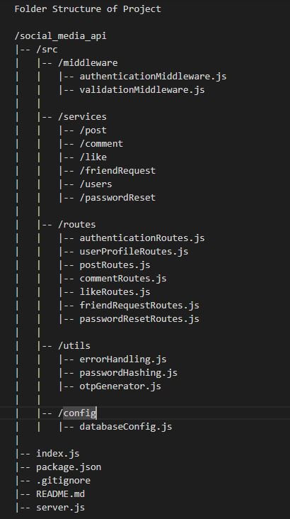

# Social-Media-Application
Full Stack Application

## Brief Explaination of Dependencies
1. **express**: A web framework for handling HTTP requests and routing.
2. **mongoose**: An Object Data Modeling (ODM) library for MongoDB and Node.js.
3. **jsonwebtoken**: Used for generating and verifying JSON Web Tokens (JWT) for authentication.
4. **bcrypt**: A library for hashing passwords securely.
5. **body-parser**: Middleware to parse incoming request bodies.
6. **cors**: Middleware for enabling Cross-Origin Resource Sharing.
7. **dotenv**: Loads environment variables from a .env file.
8. **helmet**: Adds security headers to HTTP responses.
9. **morgan**: HTTP request logger middleware.
10. **validator**: A library for input validation.